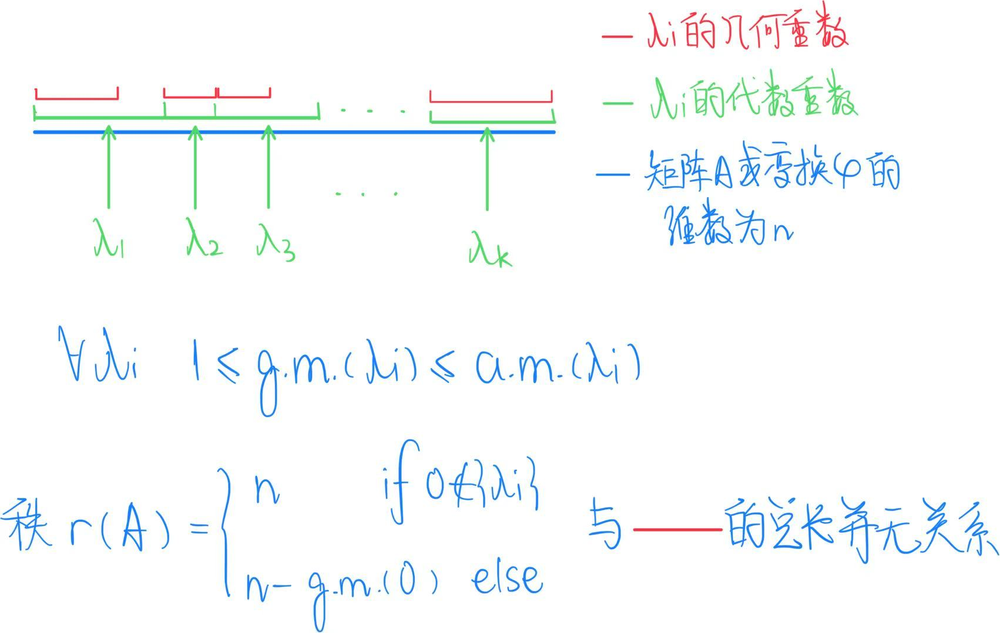

# Derivation 2——SVD

## 2.a 特征值（方阵才有）

### 2.a.α 铺垫知识——定义

**特征值eigenvalue和特征向量eigenvector：** 设矩阵 $A \in \mathbb{R}^{n \times n}$，如果存在一个非零向量 $x \in \mathbb{R}^n$ 和一个标量 $\lambda \in \mathbb{R}$（或 $\mathbb{C}$），使得
$$
\displaystyle A x = \lambda x，
$$
那么称 $\lambda$ 是矩阵 $A$ 的特征值（eigenvalue），$x$ 是对应的特征向量（eigenvector）.

**特征多项式：** 设 $A \in \mathbb{C}^{n \times n}$，定义矩阵 $A-\lambda I$，其中 $I \in \mathbb{R}^{n \times n}$是单位矩阵，$\lambda$ 是一个变量。矩阵 $A$ 的特征多项式为：
$$
p_A(\lambda) = \vert A-\lambda I\vert
$$
特征值的求解可以转化为：$\displaystyle \vert A-\lambda I\vert = 0$ , 

设矩阵 $A \in \mathbb{R}^{n \times n}$ ，**对于其一个特征值 $\lambda$，** 可以定义：

**几何重数/度数**（geometric multiplicity, g.m.）是指线性方程 $(A - \lambda I)x = 0$ 的**解空间维数**，也就是特征值 $\lambda$ 对应的特征向量所构成子空间的维数.

换句话说，它等于矩阵 $A - \lambda I$ 的零空间的维度.

**代数重数/重数**（algebraic multiplicity, a.m.）是指 $\lambda$ 作为特征多项式 $\displaystyle \vert A-\lambda I\vert$ 的一个**根的重数**（ $(t−λ)$ 的次数）. 

**完全特征向量系：**

若对 $A$ 或 $φ$ 某个特征值 $\lambda$ 的代数重数等于几何重数，即 $\text{a.m.}(\lambda) = \text{g.m.}(\lambda)$，则称 $\lambda$ 有 **完全的特征向量系**。

若对 $A$ 或 $φ$ 的每一个特征值 $\lambda$，都有 $\text{a.m.}(\lambda) = \text{g.m.}(\lambda)$，则称 $A$ 或 $φ$ 有 **完全的特征向量系**。 

**【例】**考虑矩阵$\displaystyle A = \begin{bmatrix} 2 & 1 & 0 & 0 & 0 \newline 0 & 2 & 1 & 0 & 0 \newline 0 & 0 & 2 & 0 & 0 \newline 0 & 0 & 0 & 3 & 1 \newline 0 & 0 & 0 & 0 & 3 \end{bmatrix}$

因为 $A$ 是上三角矩阵，所以特征值就是主对角线上的数：$\lambda_1 = 2, \quad \lambda_2 = 3$.

- $\lambda = 2$ 出现 3 次（代数重数 $\text{a.m.}(2) = 3$），$\lambda = 3$ 出现 2 次（代数重数 $\text{a.m.}(3) = 2$）

计算 $\ker(A - 2I)$ 和 $\ker(A - 3I)$ 的维数：

- $$A - 2I = \begin{bmatrix}
  0 & 1 & 0 & 0 & 0 \newline
  0 & 0 & 1 & 0 & 0 \newline
  0 & 0 & 0 & 0 & 0 \newline
  0 & 0 & 0 & 1 & 0 \newline
  0 & 0 & 0 & 0 & 1
  \end{bmatrix}$$

  其秩为4，所以 $\dim\ker(A - 2I) = n - \operatorname{r}(A - \lambda I)=5-4=1$。
  即 $\text{g.m.}(2) = 1 < \text{a.m.}(2) = 3$。
- 同理 $\text{g.m.}(3) = 1 < \text{a.m.}(3) = 2$。

### 2.a.β 性质

> 对每一个特征值 $\lambda$ ，几何重数总是<u>小于或等于</u>代数重数.即 $\displaystyle \text{geom. mult.}(\lambda) \leq \text{alg. mult.}(\lambda)$ 

> 矩阵 $A$ 所有特征值对应的代数重数的总和一定是 $n$ （特征多项式最高项次数为 $n$ ）

> 矩阵秩=矩阵维数 $-$ 零特征值几何重数：$\operatorname{r}(A)  = \dim A- \text{geom. mult.}(\lambda=0)=n−\dim(\ker A)$ 

> 矩阵 $A$ <u>不同特征值对应的特征向量</u>一定线性无关

**证明：**设 $A \in \mathbb{C}^{n \times n}$（或者 $\mathbb{R}^{n \times n}$），它有 $k$ 个不同的特征值 $\lambda_1, \lambda_2, \dots, \lambda_k$，对应特征向量为 $u_1, u_2, \dots, u_k$。假设存在一组系数 $c_1, \dots, c_k$ 使得 $\displaystyle \sum_{i=1}^k c_i u_i = 0$.

为了证明线性无关，需要证明 $c_1 = c_2 = \dots = c_k = 0$。

假设 $\displaystyle \sum_{i=1}^k c_i u_i = 0$ ，对任意 $j$，左乘 $(A-\lambda_j I)$：

$\displaystyle (A-\lambda_j I)\Bigl(\sum_{i=1}^k c_i u_i\Bigr) = \sum_{i=1}^k c_i (A-\lambda_j I)u_i  = \sum_{i=1}^k c_i (\lambda_i-\lambda_j)u_i = 0.$

其中 $i=j$ 的项为0，实际上是 $\displaystyle \sum_{i,i\neq j}^k c_i (\lambda_i-\lambda_j) u_i = 0$.

 $\because\lambda_i \neq \lambda_j$，$\therefore\displaystyle \sum_{i,i\neq j}^k c_i  u_i = 0$ ，而 $\displaystyle \sum_{i=1}^k c_i u_i = 0$ ， $\therefore c_ju_j=0$ ，$\therefore c_j=0,\quad \forall j$。

$\because\displaystyle \sum_{i=1}^k c_i u_i = 0\Longrightarrow c_j=0,\quad \forall j$ ，$\therefore{u_1,u_2,\dots,u_k}$ 线性无关。

因此，不同特征值对应的特征向量一定线性无关。

**矩阵的秩与几何重数的总和没有直接关系**

## 2.b 相似对角化Similar Diagonalization (SD) /特征值分解Eigen-Value Decomposition (EVD)

### 2.b.α 相似 (Similarity)

**定义**：设 $A, B \in \mathbb{K}^{n \times n}$。如果存在可逆矩阵 $P \in \mathbb{K}^{n \times n}$，使得$B = P^{-1} A P$ ，则称 $A$ 与 $B$ **相似** (similar)，记作 $A \sim B$.

**基本性质**：

1. 相似是一个等价关系：
   - **自反性**：$A \sim A$，取 $P = I$。
   - **对称性**：若 $A \sim B$，则 $B \sim A$，取 $P^{-1}$。
   - **传递性**：若 $A \sim B$ 且 $B \sim C$，则 $A \sim C$，取 $P Q$。
2. 相似矩阵保留许多不变量：
   - 相同的**特征多项式**（带 $\lambda$ 的多项式）；
   - 相同的**特征值**（包括 $\lambda$ 对应的代数重数和代数重数）；
   - 相同的**行列式**（是特征多项式的常数项）和**迹**。
3. 几何意义：
    相似变换对应于对向量空间基的更换。换句话说，$A$ 与 $B$ 表示的是同一个线性算子，只是基不同。

### 2.b.β 相似对角化/特征值分解

**条件**：设矩阵 $A \in \mathbb{C}^{n \times n}$。<u>若 $A$ 有 $n$ 个线性无关的特征向量</u>，则 $A$ 可**相似对角化**，即：

存在可逆矩阵 $U$ 和对角矩阵 $\Lambda$，使得 $A = U \Lambda U^{-1}$。

【注】相似对角化没有对矩阵的秩作出要求（只对每个特征值 $\lambda$ 的几何重数有要求，等于代数重数）。

可相似对角化时，矩阵A的秩 $\displaystyle\operatorname{r}(A)  =\sum_{\lambda\neq 0} \text{alg. mult.}(\lambda)$ ：

**证明：** $\because A$ 有 $n$ 个线性无关的特征向量

$\therefore\displaystyle \sum_{\lambda=\lambda_i} \text{geom. mult.}(\lambda)=\dim A=n=\sum_{\lambda=\lambda_i} \text{alg. mult.}(\lambda)$

$\therefore\displaystyle\text{geom. mult.}(\lambda)= \text{alg. mult.}(\lambda),\quad\forall \lambda=\lambda_i$ 

所以矩阵 $A$ 的秩满足： 
$$
\displaystyle\begin{align*}\operatorname{r}(A)  = \dim A- \text{geom. mult.}(\lambda=0)=\sum_{\lambda=\lambda_i} \text{geom. mult.}(\lambda)- \text{geom. mult.}(0)\newline
=\sum_{\lambda\neq 0} \text{geom. mult.}(\lambda)=\sum_{\lambda\neq 0} \text{alg. mult.}(\lambda)\end{align*}
$$
 

下面给出计算 $U$ 的步骤：

Step 1：解特征多项式 $\det(A-\lambda I)=0$，得到 $A$ 全部的特征向量 $u_1,u_2,\dots, u_n$ 和对应的特征值 $\lambda_1,\lambda_2,\dots,\lambda_n$ （可能有重复的部分）.

Step 2：将这些线性无关的特征向量作为列向量拼成矩阵 $U=[u_1,u_2,\dots,u_n]$，并将全部特征值构造成对角矩阵 $\Lambda=\text{diag}(\lambda_1,\lambda_2,\dots,\lambda_n)$，其中 $\lambda_i$ 对应于列向量 $u_i$。

Step 3：因此有 ：
$$
\displaystyle\begin{align*} AU=A[u_1,u_2,\dots,u_n]=[Au_1,Au_2,\dots,Au_n]=[\lambda_1u_1,\lambda_2u_2,\dots,\lambda_nu_n]\newline=[u_1,u_2,\dots,u_n]·\begin{bmatrix} \lambda_1 & 0 & \cdots & 0 \newline 0 & \lambda_2 & \cdots & 0 \newline \vdots & \vdots  & \ddots & \vdots \newline 0 & 0 & \cdots & \lambda_n \end{bmatrix}=U·\Lambda\end{align*}
$$
两侧同时右乘 $U^{-1}$ ，得 $A = U \Lambda U^{-1}$， $U$ 即为所求。

$A$ 可对角化的**充要条件**是：

-  $A$ 有 $n$ 个线性无关的特征向量。
-  $\mathbb{C}^n$ 是 $A$ 的各个特征子空间的直和。
-  $A$ 的几何重数等于代数重数，即 $A$ 有完全的特征向量系。

$A$ 可对角化的**充分条件**是：

-  $A$ 有 $n$ 个互不相同的特征值（在实数域/复数域）。

**定理（可对角化的充分条件）**
 设矩阵 $A \in \mathbb{C}^{n\times n}$（或 $\mathbb{R}^{n\times n}$）。若 $A$ 有 $n$ 个互不相同的特征值 $\lambda_1,\lambda_2,\dots,\lambda_n$，则 $A$ 可相似对角化。

**证明：** 以下证明 $A \in \mathbb{C}^{n\times n}$ 的情况

1. 设 $u_i$ 是 $A$ 的特征向量，对应于特征值 $\lambda_i$，即$Au_i = \lambda_i u_i,\quad i=1,2,\dots,n$. 若 $\lambda_i \neq \lambda_j$，则 $u_i,u_j$ 必定线性无关

2. 假设 $\displaystyle \sum_{i=1}^n c_i u_i = 0$ ，对任意 $j$，左乘 $(A-\lambda_j I)$：

   $\displaystyle (A-\lambda_j I)\Bigl(\sum_{i=1}^n c_i u_i\Bigr) = \sum_{i=1}^n c_i (A-\lambda_j I)u_i  = \sum_{i=1}^n c_i (\lambda_i-\lambda_j)u_i = 0.$

   其中 $i=j$ 的项为0，实际上是 $\displaystyle \sum_{i,i\neq j}^n c_i (\lambda_i-\lambda_j) u_i = 0$.

    $\because\lambda_i \neq \lambda_j$，$\therefore\displaystyle \sum_{i,i\neq j}^n c_i  u_i = 0$ ，而 $\displaystyle \sum_{i=1}^n c_i u_i = 0$ ， $\therefore c_ju_j=0$ ，$\therefore c_j=0,\quad \forall j$。

3. $\displaystyle \because\sum_{i=1}^n c_i u_i = 0\Longrightarrow c_j=0,\quad \forall j $ ，$\therefore{u_1,u_2,\dots,u_n}$ 线性无关。$\therefore A$ 有 $n$ 个线性无关的特征向量，即 $A$ 可对角化。

**【例】是否能相似对角化要考虑数域**  考虑矩阵 $A = \begin{bmatrix} 0 & -1 & 0 \newline 1 & 0 & 0 \newline 0 & 0 & 2 \end{bmatrix}$.

1. 计算特征多项式：$\det(A-\lambda I) = \begin{vmatrix} -\lambda & -1 & 0 \newline 1 & -\lambda & 0 \newline 0 & 0 & 2-\lambda \end{vmatrix} = (\lambda^2+1)(2-\lambda)$.

2. 特征值为 $\lambda_1=i, \lambda_2=-i, \lambda_3=2$。

   - 对 $\lambda_1=i$，解 $(A-iI)x=0$，得到特征向量 $u_1=\begin{bmatrix} i \newline 1 \newline 0 \end{bmatrix}$。

   - 对 $\lambda_2=-i$，解 $(A+iI)x=0$，得到特征向量 $u_2=\begin{bmatrix} -i \newline 1 \newline 0 \end{bmatrix}$。

   - 对 $\lambda_3=2$，解 $(A-2I)x=0$，得到特征向量 $u_3=\begin{bmatrix} 0 \newline 0 \newline 1 \end{bmatrix}$。

3. 构造对角化：$U = \begin{bmatrix} i & -i & 0 \\ 1 & 1 & 0 \\ 0 & 0 & 1 \end{bmatrix}, \quad \Lambda = \begin{bmatrix} i & 0 & 0 \\ 0 & -i & 0 \\ 0 & 0 & 2 \end{bmatrix}$. 于是有$A = U \Lambda U^{-1}$.

​	这个矩阵在 $\mathbb{R}$ 上不可对角化，但是在 $\mathbb{C}$ 上可以对角化。

## 2.c 正交、实对称矩阵和对角化的关系

### 2.c.α 正交orthogonal

**正交定义**：设 $u, v \in \mathbb{R}^n$，如果它们的内积为零：$u^\top v = 0$，则称 $u$ 与 $v$ **正交**（orthogonal）。

- 如果 $u^\top u = 1$，则称 $u$ 是**单位向量**（unit vector）。
- 一组向量 $\lbrace u_1, u_2, \dots, u_n \rbrace$ 若两两正交且每个向量都是单位向量，则称它们组成**正交标准基**（orthonormal basis）。

**正交矩阵**：

- 若 $Q \in \mathbb{R}^{n\times n}$ 且列向量两两正交且为单位向量：$Q^\top Q = Q Q^\top = I$，，则称 $Q$ 是**正交矩阵**（orthogonal matrix）

- 正交矩阵的性质：

  1. 可逆且 $Q^{-1} = Q^\top$。

  2. 保长度：$\Vert Qx \Vert = \Vert x \Vert$。

  3. 保内积/保角度：向量之间的夹角不变。

     $\displaystyle \cos\theta' = \frac{(Qx)^\top (Qy)}{\Vert Qx \Vert \, \Vert Qy \Vert} = \frac{x^\top y}{\Vert x \Vert \, \Vert y \Vert} = \cos\theta$

### 2.c.β 实对称矩阵的一些性质

1. **实对称矩阵 $A$ 的所有特征值都是实数**。

   **证明**：设 $A \in \mathbb{R}^{n \times n}$ 且 $A^\top = A$，设 $\lambda \in \mathbb{C}$ 是 $A$ 的一个特征值，对应特征向量 $v \in \mathbb{C}^n \setminus \lbrace 0 \rbrace$，则有 $A v = \lambda v$. 

   考虑：

   $\displaystyle \begin{cases}\overline{A\eta}=\overline{\lambda\eta}\newline
   (A\eta)^{\top}=(\lambda\eta)^{\top}
   \end{cases},\quad\quad即\begin{cases}A\overline{\eta}=\overline{\lambda}\overline{\eta},\quad\quad左乘\eta^{\top}\newline
   \eta^{\top}A^{\top}=\eta^{\top}\lambda^{\top},\quad右乘\overline{\eta}
   \end{cases},\quad\quad即
   \begin{cases}\eta^{\top}A\overline{\eta}=\eta^{\top}\overline{\lambda}\overline{\eta}=\overline{\lambda}{\Vert{\eta}\Vert}^2\newline
   \eta^{\top}A^{\top}\overline{\eta}=\eta^{\top}\lambda^{\top}\overline{\eta}=\lambda{\Vert{\eta}\Vert}^2
   \end{cases}$ 

   $\therefore\overline{\lambda}{\Vert{\eta}\Vert}^2={\lambda}{\Vert{\eta}\Vert}^2\Longrightarrow \overline{\lambda}={\lambda}$ 

2. **实对称矩阵 $A$ 的内积对称性（自伴性）**

   > 设 $A \in \mathbb{R}^{n \times n}$ 且 $A^\top = A$ ，对任意 $\alpha, \beta \in \mathbb{R}^n$ 有
   > $$
   > \langle A\alpha, \beta \rangle = \langle \alpha, A\beta \rangle,\quad其中\langle x, y \rangle = x^\top y。
   > $$

   **证明**： $\langle A\alpha, \beta \rangle = (A\alpha)^\top \beta = \alpha^\top A^\top \beta = \alpha^\top A \beta = \langle \alpha, A\beta \rangle$.

    **【注】**在**复数域**上有相似的性质：

   **复厄米矩阵的内积对称性（Hermitian性质）**

   设 $A \in \mathbb{C}^{n \times n}$ 且 $A^* = A$（厄米矩阵），对任意 $\alpha, \beta \in \mathbb{C}^n$ 有
   $$
   \langle A\alpha, \beta \rangle = \langle \alpha, A\beta \rangle,\quad其中\langle x, y \rangle = x^* y。
   $$
   **证明**： $\langle A\alpha, \beta \rangle = (A\alpha)^* \beta = (\overline{A\alpha})^\top \beta = (\overline{A}\,\overline{\alpha})^\top \beta = \overline{\alpha}^\top {\overline{A}}^\top \beta = \alpha^* A^* \beta = \alpha^* A \beta = \langle \alpha, A\beta \rangle$

   注：

   - $(\cdot)^*$ 表示共轭转置，$\overline{\cdot}$ 表示复共轭，$\top$ 表示转置
   - $A^* = \overline{A}^\top = A$ 因为 $A$ 是厄米矩阵

3. **实对称矩阵 $A$ 不同特征值对应特征向量必正交**

   > 设 $A \in \mathbb{R}^{n \times n}$ 且 $A^\top = A$，$\lambda_1 \neq \lambda_2$ 是 $A$ 的两个特征值，$u_1, u_2$ 分别是对应特征向量，则 $u_1^\top u_2 = 0$，即 $u_1$ 与 $u_2$ 正交。
   >

   **证明**：
   $$
   Au_1 = \lambda_1 u_1, \quad Au_2 = \lambda_2 u_2
   $$
   两边用 $u_1^\top$ 左乘第二式：
   $$
   u_1^\top (A u_2) = \lambda_2 (u_1^\top u_2)
   $$
   利用 $A$ 对称性 $A^\top = A$ ，左边：
   $$
   \displaystyle u_1^\top (A u_2)  \xlongequal{x^\top y=y^\top x} (A u_2)^\top u_1 =u_2^\top A^\top u_1\xlongequal{A^\top = A} u_2^\top (A u_1)\xlongequal{特征值定义}u_2^\top (\lambda_1 u_1)=\lambda_1 (u_2^\top u_1)
   $$
   因此
   $$
   \lambda_1 (u_2^\top u_1) = \lambda_2 (u_1^\top u_2) \quad \Longrightarrow \quad (\lambda_1-\lambda_2) (u_1^\top u_2) = 0
   $$
   由于 $\lambda_1 \neq \lambda_2$，所以
   $$
   u_1^\top u_2 = 0
   $$
   **同一特征值的特征向量不一定正交**，但是可以正交化——找到一组**正交的特征向量基**。

4. 实对称矩阵必有 $n$ 个线性无关特征向量

5. 好的，这部分其实是**谱定理**的核心环节。证明实对称矩阵必有 $n$ 个线性无关特征向量，常用的方法是利用**不变子空间** + **归纳法**。我给你展开一个标准证明：

   ------

   ### 命题

   若 $A \in \mathbb{R}^{n\times n}$ 且 $A^\top = A$，则 $A$ 有 $n$ 个线性无关的特征向量。

6. 实对称矩阵 $A$ 必可**正交相似对角化**

   设 $A \in \mathbb{R}^{n \times n}$ 且 $A^\top = A$，则存在一个正交矩阵 $Q \in \mathbb{R}^{n \times n}$ 和一个对角矩阵 $\Lambda \in \mathbb{R}^{n \times n}$，使得
   $$
   A = Q \Lambda Q^\top
   $$
   其中 $\Lambda = \text{diag}(\lambda_1, \lambda_2, \dots, \lambda_n)$，$\lambda_i$ 为 $A$ 的特征值，且 $Q$ 的列向量为 $A$ 的标准正交特征向量。

   **证明：**按归纳法进行

   归纳奠基（$n=1$）：显然。若 $n=1$，$A=[a]$ 本身就是对角矩阵，取 $P=[1]$ 即可。

   归纳假设：假设对所有维数 $\le n-1$ 的实对称矩阵结论成立。

   归纳推理（从 $n-1$ 推到 $n$）：设 $A$ 全部的特征向量 $u_1,u_2,\dots, u_n$ 和对应的特征值 $\lambda_1,\lambda_2,\dots,\lambda_n$ （可能有重复的部分）

这个结论就是经典的 **实对称矩阵谱定理**。我给你写一个清晰的证明思路：

------

### 定理（谱定理）

若 $A \in \mathbb{R}^{n \times n}$ 且 $A^\top = A$，则存在一个正交矩阵 $Q$ 和对角矩阵 $\Lambda$，使得

A=QΛQ⊤.A = Q \Lambda Q^\top.

------

------

1. 

------

1. **实对称矩阵必有 $n$ 个线性无关特征向量**
    对 $A$ 的最小多项式分解，它可分解为互不相同一次因式的乘积（因 $A$ 可对角化，属于标准结果，也可用实数情况下的复数 Jordan 标准形并结合正交性排除非对角块来证明）。
    因此，$A$ 在 $\mathbb{R}^n$ 上可对角化，且能找到 $n$ 个线性无关的特征向量。

------

1. **标准正交化**
    由于特征向量来自不同特征值时本来就正交，而对同一特征值对应的特征子空间，可以通过 **Gram–Schmidt 正交化**，得到一组标准正交基。
    于是，所有特征向量可以组成一个正交矩阵

Q=[q1  q2  ⋯  qn],Q⊤Q=I.Q = [q_1 \; q_2 \; \cdots \; q_n], \quad Q^\top Q = I.

------

1. **正交相似对角化**
    令 $\Lambda = \text{diag}(\lambda_1, \dots, \lambda_n)$，其中 $\lambda_i$ 是对应的特征值，就有

AQ=QΛ⟹A=QΛQ⊤.AQ = Q\Lambda \quad \Longrightarrow \quad A = Q\Lambda Q^\top.

------

### 总结

实对称矩阵必可正交相似对角化，且对角矩阵的对角元为特征值，正交矩阵的列向量为一组标准正交特征向量。

------

要不要我再给你写一个 **简明版本**，用最少的步骤直接证明？
