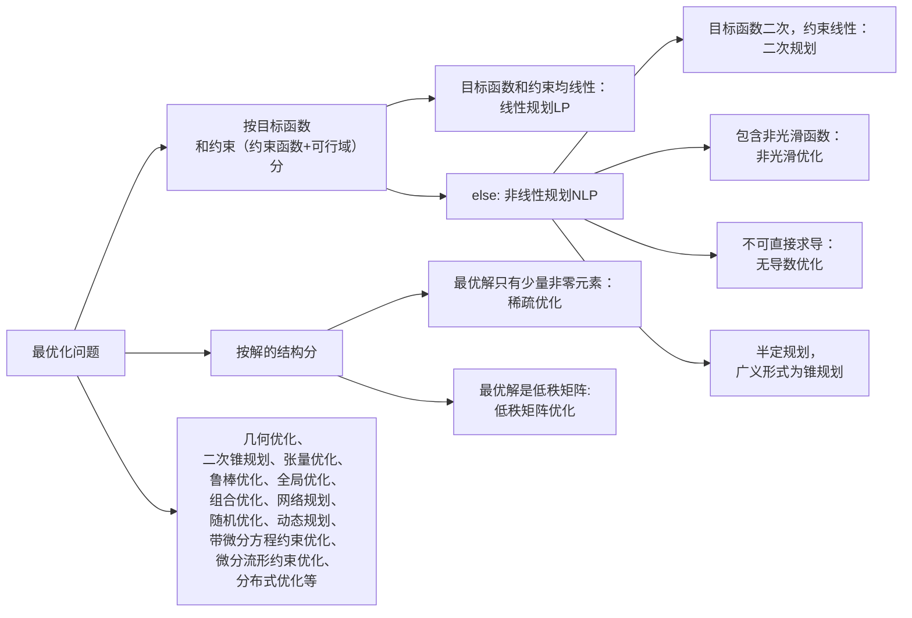
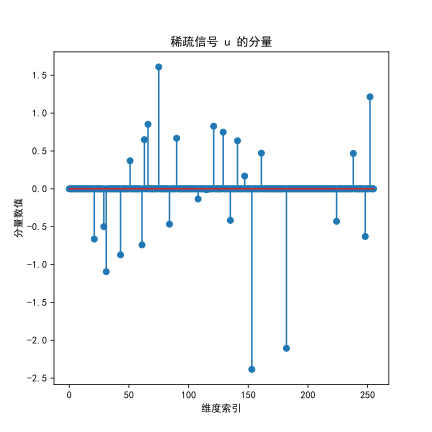
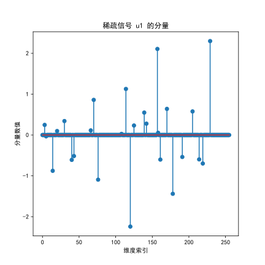
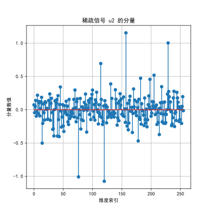

# 最优化简介

## 1.1 最优化问题概括

### 1.1.1 最优化问题的一般形式

通常可以表示为：

$$
\min_{x \in \mathbb{R}^n} f(x) \quad \text{或} \quad \inf_{x \in \mathbb{R}^n} f(x), \quad\\
\text{s.t. } x \in X
\tag{1.1.1}
$$

其中：

- $x = (x_1, x_2, \cdots, x_n)^T \in \mathbb{R}^n$ 是 **决策变量decision variables**，<u>向量/矩阵/张量/概率分布/微分流形</u>；

- $f : \mathbb{R}^n \to \mathbb{R}$ 是 **目标函数objective function**，一定是 **标量scalar** ，否则无法比较大小；

- $X \subseteq \mathbb{R}^n$ 是 **约束集合** 或 **可行域feasible set**，可以用**约束函数restrain function** $c_i(x)$表示：
  
  `$X = \left\{ x \in \mathbb{R}^n \ \middle| \ \begin{aligned}&c_i(x) \leq 0, && i = 1,2,\dots, m \\&c_i(x) = 0, && i = m+1, m+2, \dots, m+\ell\end{aligned}\right\}$`
  
  $ X = \left\lbrace x \in \mathbb{R}^n \ \middle|\  
  \begin{aligned}
  &c_i(x) \leq 0, && i = 1, 2, \dots, m \newline
  &c_i(x) = 0,    && i = m+1,m+2， \dots, m+\ell
  \end{aligned}
  \right\rbrace $
  
  集合 **$X$** 中的点称为 **可行解** 或 **可行点（feasible solution/feasible vector）**；

使目标函数取最小值的变量$x^∗$称为优化问题 的**最优解（optimal (feasible) solution）**，目标函数的最值称为**最优值optimal value**（如果是成本函数称为最优成本optimal cost）。

### 1.1.2 最优化问题的类型与应用背景

回顾最优化三要素：**目标函数**、**约束条件**、**决策变量**。约束=约束函数+决策变量可行域



注：半定规划的目标函数和约束函数都是线性的，但是可行域是**非线性集合约束**，因为集合 $\lbrace X \mid X \succeq 0 \rbrace$是一个**凸锥**，但不是线性子空间。所以半定规划是NP。

### 1.1.3 投资组合问题——Markowitz 模型为例

数学建模很容易给出应用问题不同的模型，可以对应性质很不相同的问题，其求解难度和需要的算法也将差别很大．

在投资组合优化中，人们希望通过寻求最优的投资组合以降低风险、提高收益． 这时决策变量xi表示在第i项资产上的投资额，向量$x∈R^n$表示整体的投资分配． 约束条件可能为总资金数、每项资产的最大（最小）投资额、最 低收益等． 目标函数通常是某种风险度量． 

- 如果是极小化收益的方差，则该问题是典型的二次规划. 
- 如果极小化风险价值(value at risk)函数，则该问题是混合整数规划.
- 如果极小化条件风险价值（conditional value at risk) 函数，则该问题是非光滑优化，也可以进一步化成线性规划．

#### 变量定义：
- $ u_i $：随机变量，表示股票 $i$ 的回报率，其期望 $\displaystyle \mathbb{E}(u_i) = \int_{-\infty}^{\infty} u_i \cdot p(u_i) \, du_i= \mu_i$ ，向量 $\mathbf{u}$ 的期望为 ${\mu}$ 
- $x_i $：投资于股票 $i$ 的相对金额（可归一化为权重），向量 $\mathbf{x}$ 。  

#### 目标函数：
1. **回报**：  $r = u_1 x_1 + u_2 x_2 + \ldots + u_n x_n=\mathbf{u}^\top \mathbf{x}$，标量 $r$ 也是随机变量，服从分布$\pi(r)$

2. **期望收益**： $
   \displaystyle R = E(r)={\mu}^\top \mathbf{x}$ 

3. **回报风险（方差）**： $\displaystyle 
   V = \text{Var}(r) = \sum_{i,j}  x_i\sigma_{ij} x_j = x^\top \Sigma x$ ，其中$ \sigma_{ij} $是股票  $i$ 和 $j$ 的协方差，$ {\Sigma} $ 为协方差矩阵。 因为稳健投资者更关注波动，所以将方差作为风险。
   
4. **损失函数**： $L = -r $ ，这里直接用投资组合回报的相反数作为损失函数，回报越大，损失越少

5. **风险价值**：损失函数的 $\alpha$ 分位数：$\text{VaR}_\alpha(L) = \inf \{ \ell \in \mathbb{R} : P(L \le \ell) \ge \alpha \}$ ，代表在置信水平 $\alpha$ 下，损失不会超过$\text{VaR}_\alpha(L)$

6. **条件风险价值**：$\text{CVaR}_\alpha(L) = \mathbb{E}[ L \mid L \ge \text{VaR}_\alpha(L) ]$ ，表示在损失超过阈值$\text{VaR}_\alpha(L)$时的平均损失

   

#### 优化问题：

在**给定回报风险**（即方差）下，最大化投资组合的**期望收益** ，或者考虑 $\displaystyle \max_{\mathbf{x}} \boldsymbol{\mu}^\top \mathbf{x} - \lambda \mathbf{x}^\top \Sigma \mathbf{x}$ （加入对风险的惩罚项）；

或者在**给定期望收益目标** $r_0$ 下，最小化投资组合的**回报风险**。
$$
\displaystyle \begin{align*}
\min\quad & \text{risk measure} \newline
\text{s.t.}\quad & R \geq r_0 \newline
& \sum_{i=1}^n x_i = 1 \newline
& x_i \geq 0
\end{align*}
$$
关键是如何定义$risk\ measure$ ——可以用损失函数、条件风险价值

常用**条件风险价值**： $\displaystyle \min \ \eta + \frac{1}{1 - \alpha} \mathbb{E}\left[ \left( -x^\top r - \eta \right)^+ \right]$ 


## 1.2 实例：稀疏优化

### 1.2.1 问题引入

#### 方程： $A_{m\times n}x_{n\times 1}=b_{m\times 1}$ 求解问题

针对方程： $A_{m\times n}x_{n\times 1}=b_{m\times 1}$ ，向量 $b$ 的维数远小于向量 $x$ 的维数，即 $m \ll n$ （根据较短的信号重构原始的信号），但是方程个数远少于未知数，属于**欠定系统——无穷多个解**，不过加上**先验条件**（**稀疏性**，原始信号中有较多的零元素）和其他约束条件，可以筛选出精确解。

```python
import numpy as np
from scipy import sparse

# 参数设置
m = 128
n = 256

# 生成高斯随机矩阵 A ∈ ℝ^{m×n}
A = np.random.randn(m, n)

# 生成稀疏信号 精确解u ∈ ℝ^n，稀疏度为 10%
sparsity = 0.1
# u = sparse.random(n, 1, density=sparsity, data_rvs=np.random.randn).toarray()#得到的是二维(n,1)，否则# A @ x 是 (m,) ，而 b 是 (m,1)，出现广播，cvxpy要报错
u = sparse.random(n, 1, density=sparsity, data_rvs=np.random.randn).toarray().flatten()  # 转为 (n,)

# 计算观测值 b = A @ u
b = A @ u
```

#### 常见范数优化问题

考虑下面三个范数问题：
$$
\displaystyle 
(\ell_0)\begin{cases} 
\min\limits_{x \in \mathbb{R}^n} & \Vert x \Vert_0, \newline
\text{s.t.} & A x = b. 
\end{cases} \quad
(\ell_1)\begin{cases} 
\min\limits_{x \in \mathbb{R}^n} & \Vert x \Vert_1, \newline
\text{s.t.} & A x = b. 
\end{cases} \quad
(\ell_2)\begin{cases} 
\min\limits_{x \in \mathbb{R}^n} & \Vert x \Vert_2, \newline
\text{s.t.} & A x = b. 
\end{cases}
$$
$\Vert x\Vert_0$ ， $\ell_0$ 范数优化问题，是指 $x$ 中非零元素的个数

$\displaystyle \Vert x\Vert_1 = \sum_{i=1}^{n} \Vert x_i\Vert $ ， $\ell_1$ 范数优化问题，基追踪问题

$\displaystyle \Vert x \Vert_2 = \left( \sum_{i=1}^{n} x_i^2 \right)^{1/2}  $ ， $\ell_2$ 范数问题，实际上就是原点到仿射集 $Ax=b$ 的投影

[^l2范数]: 找出距离原点最近的满足 $Ax = b$ 的点。换句话说，就是在仿射子空间 $\lbrace x \mid Ax = b \rbrace$ 上做正交投影，投影点是该仿射集到原点的最近点

| 范数类型 | 范数球（范数等值线）特性 | 解的特性                   |
| :------: | :----------------------- | :------------------------- |
| $\ell_0$ | 退化为坐标轴的           | 交点位于坐标轴（严格稀疏） |
| $\ell_1$ | 超空间下的菱形           | 交点通常在顶点（稀疏性）   |
| $\ell_2$ | 球形                     | 切点任意（非稀疏）         |

$\ell_0$ 范数问题要求 $x$ 尽可能稀疏，即要求尽可能落在多条坐标轴的交点上（这样取0的维度更多）； $\ell_1$ 范数问题对应的范数球在二维是一个**菱形**（在高维也是尖角），其顶点在坐标轴上（例如 $(\pm k, 0)$ 和 $(0, \pm k)$）。当做约束时，直线（超平面） $Ax = b$ 和这个范数球相切的地方更容易是顶点（坐标轴上）；$\ell_2$ 范数球是球形，要求随意，一般不能保证解的稀疏性。

#### $\ell_0$ 范数可用$\ell_1$ 范数间接求解

对于$\ell_0$ 范数问题，由于 $\Vert x\Vert_0$ 是不连续的函数（取值只可能是整数），问题实际上是 **NP (non-deterministic polynomial) 难**的，求解起来非常困难。但是从理论上证明：**若 $A, b$ 满足一定的条件，$\ell_0$ 范数可以用 $\ell_1$ 范数替代**

本题计算 $\ell_1$ 范数下的解如下（ $\ell_2$ 范数下同理）：

```python
# 用cvxpy求解L1范数最小化
import cvxpy as cp
# 定义优化问题
x1 = cp.Variable(n)#定义一个优化变量 x ∈ ℝⁿ
objective = cp.Minimize(cp.norm(x1, 1))  # ℓ1范数
constraints = [A @ x1 == b]             # 约束条件，信号 x 应满足观测条件

# 求解
prob1 = cp.Problem(objective, constraints)
prob1.solve(solver=cp.SCS)
u1 = x1.value

# 画出恢复信号分布（非零部分）
plt.figure(figsize=(6, 6))
plt.stem(u1)
plt.title("稀疏信号 u1 的分量")
plt.xlabel("维度索引")
plt.ylabel("分量数值")
plt.savefig("../images/01c-ℓ1范数下解u1的分布.svg", format="svg")
```

得到精确的稀疏信号u的分布、 $\ell_1$ 范数下的稀疏信号u1的分布， $\ell_2$ 范数下的稀疏信号u2的分布如下。可以看出 $(a)$ 和 $(b)$ 是完全一样，而 $(c)$ 则与 $u$ 实际的分布相差明显，虽然隐约能看出数据点的大致趋势，但已经不可分辨非零元素的具体位置：

<div style="display: flex; justify-content: center; margin-bottom: 40px; position: relative;">
  <div style="width: 48%; margin-right: 4%; position: relative;">
    
    <span style="position: absolute; bottom: -25px; left: 0; right: 0; text-align: center; font-size: 0.85em; color: #666;">
      (a) 原始稀疏信号u的精确分布
    </span>
  </div>
  <div style="width: 48%; position: relative;">
    
    <span style="position: absolute; bottom: -25px; left: 0; right: 0; text-align: center; font-size: 0.85em; color: #666;">
      (b) ℓ1范数优化解u1的分布
    </span>
  </div>
</div>

  <div>
    
  <p style="font-size: 0.9em; color: #666; margin: 8px auto 0; text-align: center; width: fit-content;">(c) ℓ2范数优化解u2的分布</p>


### 1.2.2 $\ell_1$ 范数优化

关于$\ell_1$ 范数优化的理论和算法研究在2006年左右带来了革命性的影响。理论上研究的课题包括什么条件下问题的解具有稀疏性，如何改进这 些条件，如何推广这些条件到其他应用。常见的数据矩阵 $A$ 一般来源于离散余弦变换（DCT）、小波变换（Wavelet）、傅里叶变换（Fourier）等，它们本身未必稀疏，但具有良好的性质，比如 RIP（Restricted Isometry Property）或互不相干性（incoherence），可以保证问题存在稀疏解。

####  $\ell_1$ 最小化和 $\ell_0$ 最小化解一致的条件

为了保证 $\ell_1$ 最小化和 $\ell_0$ 最小化问题的解一致，矩阵 $A$ 需要满足条件（或）：

1. **限制等距性（Restricted Isometry Property，RIP条件）**：存在常数 $\delta_k \in (0, 1)$，对所有 $k$-稀疏向量 $x$，满足
   $$
   \displaystyle (1 - \delta_k) \Vert x \Vert_2^2 \leq { \Vert Ax  \Vert_2^2} \leq {(1 + \delta_k)  \Vert x  \Vert_2^2}
   $$
    且如果 $\delta_{2k} < \sqrt{2} - 1$ ，则 $\ell_1$ 和 $\ell_0$ 最小化问题有相同的唯一解。

   即若 $A$ 的 $2k$ 阶 RIP 常数 $\delta_{2k} < \sqrt{2}-1$，则 $\ell_1$ 可精确恢复 $k$-稀疏解。  

   （充分非必要条件。**不满足 RIP**，有时仍然可能可以准确恢复稀疏解）

2. **零空间性质（Null Space Property，NSP条件）**：对于任意索引集合 $S \subseteq {1, \ldots, n}$，且 $|S| = s$，所有非零向量 $h \in \ker(A)$ 满足：
   $$
   \displaystyle  \Vert h_S  \Vert_1 <  \Vert h_{S^c} \Vert_1
   $$

   - 其中 $h_S$ 表示 $h$ 在集合 $S$ 上的分量，$S^c$ 是 $S$ 的补集。
   - 如果满足此条件，则 $\ell_1$ 最小化能够唯一恢复所有 $s$-稀疏解。

   NSP是 $\ell_1$ 恢复 $\ell_0$ 解的充分必要条件。如果矩阵$A$不满足NSP，就肯定存在某些稀疏信号无法通过$\ell_1$​最小化来准确恢复。
   $$
   \displaystyle \text{RIP} \Rightarrow \text{NSP} \quad \text{但} \quad \text{NSP} \nRightarrow \text{RIP}
   $$

3. **互相关性（Mutual Coherence）**：若 $\displaystyle \mu(A) = \max_{i \neq j} \frac{|\langle a_i, a_j \rangle|}{\|a_i\|_2 \|a_j\|_2}$ 是 $A$ 的列间最大余弦相似度，则若 $\displaystyle k < \frac{1}{2}\left(1+\frac{1}{\mu(A)}\right)$，$\ell_1$ 最小化能够保证稀疏解是唯一的。
   列越不相关，越容易恢复稀疏解。

4. **精确恢复条件（ERC）**：设 $S$ 为稀疏向量的支撑集，$A_S$ 为 $A$ 中对应 $S$ 的列子矩阵，若 $\displaystyle \max_{i \notin S} |A_S^\dagger a_i|_1 < 1$，则 $\ell_1$ 最小化能精确恢复支撑集 $S$ 上的解。

#### $\ell_1$ 范数优化的现状

存在的问题——

- 绝对值函数在 $x = 0$ 处不可导，$\ell_1$ 最小化是一个<u>非光滑优化问题</u>；
- 可转化为线性规划问题，但因为在实际中 $A$ 往往是**稠密矩阵**或**无法显式存储**（只能用 $Ax$ 或 $A^\top y$ 的形式访问），<u>传统的单纯形法与内点法难以应对大规模情形</u>。

解决方案——

研究者开发了诸如 **ISTA、FISTA、ADMM** 等适应大规模场景的专门算法。


**LASSO（Least Absolute Shrinkage and Selection Operator）**——带有 $\ell_1$ 正则项的无约束优化问题，其形式为：

$$\displaystyle \min_{x \in \mathbb{R}^n} \ \mu \Vert x \Vert_1 + \frac{1}{2} \Vert Ax - b \Vert_2^2 $$ 

其中 $\mu > 0$ 是正则化参数，$\Vert x \Vert_1$ 是 $\ell_1$ 范数，$\Vert Ax - b \Vert_2^2$ 是残差的平方 $\ell_2$ 范数。


### 1.2.3 实际意义

在压缩感知应用中，通常通过验证更强的RIP条件来保证恢复性能，因为：

- RIP条件更容易通过概率方法验证（如随机高斯矩阵）
- RIP不仅保证精确恢复，还能保证在噪声情况下的稳定性


## 1.3 实例：低秩矩阵恢复

## 1.4 实例：深度学习

## 1.5 最优化的基本概念
