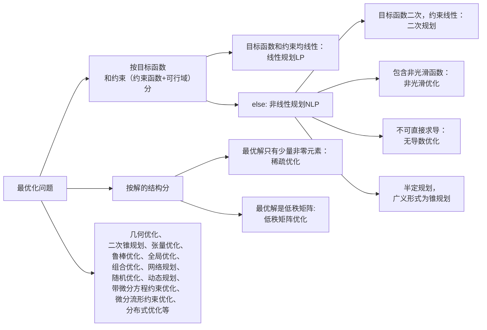

# 最优化简介

## 1.1 最优化问题概括

### 1.1.1 最优化问题的一般形式

通常可以表示为：

$$
\min_{x \in \mathbb{R}^n} f(x) \quad \text{或} \quad \inf_{x \in \mathbb{R}^n} f(x), \quad\\
\text{s.t. } x \in X
\tag{1.1.1}
$$

其中：

- $x = (x_1, x_2, \cdots, x_n)^T \in \mathbb{R}^n$ 是 **决策变量decision variables**，<u>向量/矩阵/张量/概率分布/微分流形</u>；

- $f : \mathbb{R}^n \to \mathbb{R}$ 是 **目标函数objective function**，一定是 **标量scalar** ，否则无法比较大小；

- $X \subseteq \mathbb{R}^n$ 是 **约束集合** 或 **可行域feasible set**，可以用**约束函数restrain function** $c_i(x)$表示：
  
  `$X = \left\{ x \in \mathbb{R}^n \ \middle| \ \begin{aligned}&c_i(x) \leq 0, && i = 1,2,\dots, m \\&c_i(x) = 0, && i = m+1, m+2, \dots, m+\ell\end{aligned}\right\}$`
  
  $ X = \left\lbrace x \in \mathbb{R}^n \ \middle|\  
  \begin{aligned}
  &c_i(x) \leq 0, && i = 1, 2, \dots, m \newline
  &c_i(x) = 0,    && i = m+1,m+2， \dots, m+\ell
  \end{aligned}
  \right\rbrace $
  
  集合 **$X$** 中的点称为 **可行解** 或 **可行点（feasible solution/feasible vector）**；

使目标函数取最小值的变量$x^∗$称为优化问题 的**最优解（optimal (feasible) solution）**，目标函数的最值称为**最优值optimal value**（如果是成本函数称为最优成本optimal cost）。

### 1.1.2 最优化问题的类型与应用背景

回顾最优化三要素：**目标函数**、**约束条件**、**决策变量**。约束=约束函数+决策变量可行域

注：半定规划的目标函数和约束函数都是线性的，但是可行域是**非线性集合约束**，因为集合 $\lbrace X \mid X \succeq 0 \rbrace$是一个**凸锥**，但不是线性子空间。所以半定规划是NP。

### 1.1.3 投资组合问题——Markowitz 模型为例

数学建模很容易给出应用问题不同的模型，可以对应性质很不相同的问题，其求解难度和需要的算法也将差别很大．

在投资组合优化中，人们希望通过寻求最优的投资组合以降低风险、提高收益． 这时决策变量xi表示在第i项资产上的投资额，向量$x∈R^n$表示整体的投资分配． 约束条件可能为总资金数、每项资产的最大（最小）投资额、最 低收益等． 目标函数通常是某种风险度量． 

- 如果是极小化收益的方差，则该问题是典型的二次规划. 
- 如果极小化风险价值(value at risk)函数，则该问题是混合整数规划.
- 如果极小化条件风险价值（conditional value at risk) 函数，则该问题是非光滑优化，也可以进一步化成线性规划．

#### 变量定义：
- $ u_i $：随机变量，表示股票 $i$ 的回报率，其期望 $\displaystyle \mathbb{E}(u_i) = \int_{-\infty}^{\infty} u_i \cdot p(u_i) \, du_i= \mu_i$ ，向量 $\mathbf{u}$ 的期望为 ${\mu}$ 
- $x_i $：投资于股票 $i$ 的相对金额（可归一化为权重），向量 $\mathbf{x}$ 。  

#### 目标函数：
1. **回报**：  $r = u_1 x_1 + u_2 x_2 + \ldots + u_n x_n=\mathbf{u}^\top \mathbf{x}$，标量 $r$ 也是随机变量，服从分布$\pi(r)$

2. **期望收益**： $
   \displaystyle R = E(r)={\mu}^\top \mathbf{x}$ 

3. **回报风险（方差）**： $\displaystyle 
   V = \text{Var}(r) = \sum_{i,j}  x_i\sigma_{ij} x_j = x^\top \Sigma x$ ，因为稳健投资者更关注波动
   其中$ \sigma_{ij} $是股票  $i$ 和 $j$ 的协方差，$ {\Sigma} $ 为协方差矩阵。  

4. **损失函数**： $L = -r $ ，这里直接用投资组合回报的相反数作为损失函数，回报越大，损失越少

5. **风险价值**：损失函数的 $\alpha$ 分位数：$\text{VaR}_\alpha(L) = \inf \{ \ell \in \mathbb{R} : P(L \le \ell) \ge \alpha \}$ ，代表在置信水平 $\alpha$ 下，损失不会超过$\text{VaR}_\alpha(L)$

6. **条件风险价值**：$\text{CVaR}_\alpha(L) = \mathbb{E}[ L \mid L \ge \text{VaR}_\alpha(L) ]$ ，表示在损失超过阈值$\text{VaR}_\alpha(L)$时的平均损失

   

#### 优化问题：

在**给定回报风险**（即方差）下，最大化投资组合的**期望收益** ，或者考虑 $\displaystyle \max_{\mathbf{x}} \boldsymbol{\mu}^\top \mathbf{x} - \lambda \mathbf{x}^\top \Sigma \mathbf{x}$；

或者在**给定期望收益目标** $r_0$ 下，最小化投资组合的**回报风险**。
$$
\begin{align*}
\min\quad & \text{risk measure} \\
\text{s.t.}\quad & R \geq r_0 \\
& \sum_{i=1}^n x_i = 1 \\
& x_i \geq 0
\end{align*}
$$
关键是如何定义$risk\ measure$ ——可以用损失函数、条件风险价值

常用**条件风险价值**： $\displaystyle \min \ \eta + \frac{1}{1 - \alpha} \mathbb{E}\left[ \left( -x^\top r - \eta \right)^+ \right]$ 

## 1.2 实例：稀疏优化
