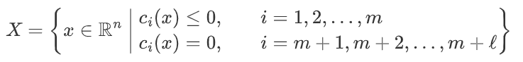

# Preference

## 写在最前面

本笔记主要记录 Lucien Clinton 自 2025 年暑假开始学习最优化的过程，包括网课笔记、理论推导与 Python/R 实现代码。为贯彻“学以致用，理论联系实际”的原则，每一章节末尾均附上对应的编程实现。

在首次尝试使用 Docsify 搭建笔记网站的过程中遇到诸多挑战：Typora、GitHub与 Docsify 在LateX上的兼容性问题频繁出现，网络上相关参考资料也相对有限。因此，笔记前言也记录在过程中遇到的问题与解决方案，便于日后查阅参考。

最后祝愿自己学有所获！

<div align="right">2025年7月5日</div>

## 遇到的各种问题

### 1. Typora常用快捷键——

1. Ctrl+数字几——几级标题大小，0代表段落正文，可以选中内容使用

2. Ctrl+A——全选

3. Ctrl+B——加粗，可以选中内容，如果是光标则自动判断要加粗的部分

4. Ctrl+I——斜体，同上

5. Ctrl+T——表格

6. Ctrl+S——保存

7. Ctrl+E——选中这一行

8. Ctrl+F——查找

9. F3 / Enter——查找下一个
   Shift + F3 / Shift + Enter——查找上一个

10. Ctrl+K——加入链接

11. Ctrl+M或者$$$+Esc——内联数学公式inline math

12. Ctrl+U——下划线

13. Ctrl+W——关闭

14. Ctrl+/——源代码模式

15. Ctrl+\——清除格式

16. Ctrl+,——偏好设置


12. \>或者Ctrl+Shift+Q——引用格式

    > 如此

13. *+Space或者-+Space或者Ctrl+Shift+]——无序列表（在干净环境下是一级）

    - 如此，这是二级（这里已经有一级10.了），然后Enter→Delete→-+Space，如下
      - 这是三级无序
        * 四级和三级一样

14. Ctrl+Shift+I——插入图片

15. Ctrl+Shift+S——另存为

16. Ctrl+Shift+F——把系統輸入法改爲繁體

17. Ctrl+Shift+K或者```+Enter——Code代码框，可以选中内容使用

18. Ctrl+Shift+1——展示/不展示大纲

19. Ctrl+Shift+2——文档列表视图

20. Ctrl+Shift+3——文件树视图

21. Ctrl+Shift+L——显示\隐藏侧边栏

22. Ctrl+Shift+M——行外数学公式

23. Ctrl+Shift+up/down——向上\下选一行

24. Ctrl+Shift+left/right——向左\右选一个token

25. Ctrl+shift+\`——`代码块格式`

26. Alt+Shift+5或者\~\~内容~~——删除线

27. ---+Enter——分割线

28. [toc]+Enter——打印目录

29. \[\^注释概要\]:注释内容——加入注释

    [^name]:input description here

30. Tab/Shift+Tab——向前\向后缩进

31. \<sub>内容\</sub>——下标

32. \<sup>内容\</sup>——上标

33. \==内容==——高亮

34. \<center>+内容+\</center>——居中

35. \<p align="right">内容\</p>——右对齐（左对齐同理）


### 2. {}在Typora行内公式和行外公式环境下可见但在网页中出错——

在Typora里面显示如下：



但是在docsify架构的网页里面，虽然尝试使用了五种不同的架构方式：

```markdown
$X = \left{ x \in \mathbb{R}^n \ \middle| \ \begin{aligned} &c_i(x) \leq 0, && i = 1,2,\dots, m \ &c_i(x) = 0, && i = m+1, m+2, \dots, m+\ell \end{aligned} \right}$ 

$$ X = \left{ x \in \mathbb{R}^n ,\middle|, \begin{cases} c_i(x) \leq 0, & i = 1, 2, \dots, m \ c_i(x) = 0, & i = m+1, \dots, m+\ell \end{cases} \right} $$ $$ X = \Bigg{ x \in \mathbb{R}^n ,\Bigg|, \begin{cases} c_i(x) \leq 0, & i = 1, 2, \dots, m \ c_i(x) = 0, & i = m+1, \dots, m+\ell \end{cases} \Bigg} $$

$$ X = \left{ x \in \mathbb{R}^n ,\middle|, \begin{cases} c_i(x) \leq 0, & i = 1, 2, \dots, m \ c_i(x) = 0, & i = m+1, \dots, m+\ell \end{cases} \vphantom{\begin{cases} \end{cases}} \right} $$

$$ X = \left{ x \in \mathbb{R}^n ,\middle|, \begin{aligned} &c_i(x) \leq 0, && i = 1, 2, \dots, m \ &c_i(x) = 0, && i = m+1, \dots, m+\ell \end{aligned} \right} $$

$$ X = \left\lbrace x \in \mathbb{R}^n ,\middle|, \begin{aligned} &c_i(x) \leq 0, && i = 1, 2, \dots, m \ &c_i(x) = 0, && i = m+1, \dots, m+\ell \end{aligned} \right\rbrace $$
```

但是都没有效果（其实第五个可以，但是还需要改一点）：


目前推测为docsify的**MathJax**在配置时误解了`\{`的含义，而且不能正确配对`\left`和`\right`

目前发现可行的解决方案是

1. 使用``包裹在行内代码或者行外代码外，效果如下：
   `$X = \left\{ x \in \mathbb{R}^n \ \middle| \ \begin{aligned}&c_i(x) \leq 0, && i = 1,2,\dots, m \\&c_i(x) = 0, && i = m+1, m+2, \dots, m+\ell\end{aligned}\right\}$`，勉强能看，颜色还不错

2. 使用`\lbrace`和`\rbrace`代替{}包裹

   ```markdown
    X = \left\lbrace x \in \mathbb{R}^n \ \middle|\  
   \begin{aligned}
   &c_i(x) \leq 0, && i = 1, 2, \dots, m \newline
   &c_i(x) = 0,    && i = m+1,m+2， \dots, m+\ell
   \end{aligned}
   \right\rbrace
   ```

   效果如下：$ X = \left\lbrace x \in \mathbb{R}^n \ \middle|\  
   \begin{aligned}
   &c_i(x) \leq 0, && i = 1, 2, \dots, m \newline
   &c_i(x) = 0,    && i = m+1,m+2， \dots, m+\ell
   \end{aligned}
   \right\rbrace$


